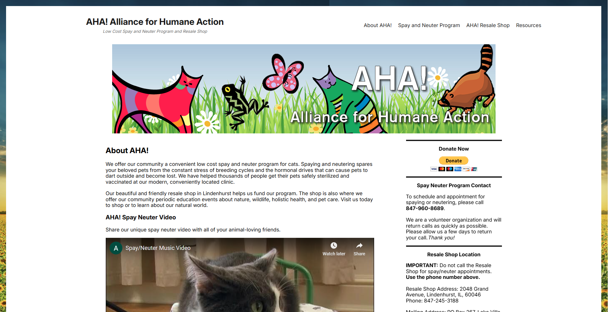

# AHA! Alliance for Humane Action

This is a website rework at the request of the folks at AHA!. This version has been rebuilt from the ground up using React in order to allow for speed and future enhancement as the non-profit
organization grows. It is a clone of the previous site with small formatting and styling changes with the aim of optimization. As AHA! grows, the React base will make it easy to add features and
maintain function of the site.

Aside from the base, some other changes include:

- React Routing
- YouTube video embedded into the page
- Responsive styling with smoother changes

